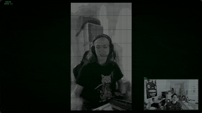
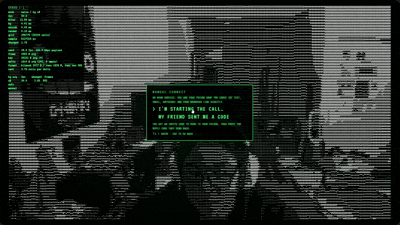

```
 ____  _____ __  __    _    ____  _   _  ___  ____  ___ ____
/ ___|| ____|  \/  |  / \  |  _ \| | | |/ _ \|  _ \|_ _/ ___|
\___ \|  _| | |\/| | / _ \ | |_) | |_| | | | | |_) || | |
 ___) | |___| |  | |/ ___ \|  __/|  _  | |_| |  _ < | | |___
|____/|_____|_|  |_/_/   \_\_|   |_| |_|\___/|_| \_\___\____|
```

**A live video call made of text.**

<p align="center">
  
</p>

**[▶ Live demo](https://kenchollacoop2005.github.io/Semaphoric/)** · [How it works](#how-it-works) · [Results](#results) · [Limits](#browser-support-and-limits)

Semaphoric turns your webcam into ASCII art right in the browser and sends the characters, not the pixels, straight to the other person. No media server, no accounts, nothing to install. The page also measures its own bandwidth against real video over the same connection, so you can see exactly what a text video call costs.

---

## Why

Video calls break badly on weak connections. The picture turns to blocks, freezes, then drops. A grid of characters is a different kind of signal: it's small, it's simple to send, and it stays readable when it gets coarse.

So Semaphoric asks one question: **how little does a video call actually need to be?** It's built for the places normal video struggles:

- weak, unstable, or expensive connections
- low-power devices
- small accessory screens, where a clean text image beats a pixelated video

It isn't trying to replace your usual call app. It's an experiment in how small video can get and still be useful, and it measures the answer live.

---

## Try it

1. Open the **[live demo](https://kenchollacoop2005.github.io/Semaphoric/)** in Chrome, Edge, or another Chromium-based browser. (Opera GX blocks the connection, see [limits](#browser-support-and-limits).)
2. Choose **HOST CALL**, enter a display name, and send the other person the link or the room code.
3. They open it, enter a name, and you're connected.

**Just want to see it work?** Open the demo in two tabs and call yourself.

**Room code not connecting?** Use **manual connect** under JOIN CALL. It swaps two short codes you paste to each other, with no third party involved at all.

<p align="center">
  
</p>

---

## Features

### The picture

- **Live ASCII filter.** Webcam to character grid at up to 30 fps, entirely in the browser.
- **Braille mode.** Each braille character is a 2×4 grid of dots, so every cell carries 8 "pixels" instead of one brightness level, at the same 1 byte per cell. Small text, like a book cover held up to the camera, stays readable.
- **Charsets.** Standard ramp, alphabet (sorted by measured ink coverage), or any custom string.
- **Background removal, two ways.**
  - **Auto:** MediaPipe person segmentation.
  - **Manual:** step out of frame for 5 seconds while it learns the empty room, then everything that still matches goes black. It compensates for the camera's auto-exposure shifting as you walk back in.
  - Removed background is sent as one blank glyph, so it drops out of the stream once it's stable.

### The call

- **Room codes.** Share `amber-falcon-4172` or a link. Once the two browsers find each other, every frame goes directly between them.
- **Manual connect.** A fully serverless handshake: two pasted codes of about 550–660 characters, with a step-by-step guide.
- **Two people per room.** A third is politely turned away.

### The proof

- **Live bandwidth counter.** Measured bytes on the wire and raw app payload, shown separately, plus keyframe vs. delta sizes and % of cells changed per frame.
- **Real-video comparison.** One toggle sends your actual webcam video over the same connection, so both numbers are measured side by side, with a live ratio and a rolling graph.

### The lab (Experimental tab)

- **Bandwidth cap.** Set a budget, like a 56 kbps dial-up modem, and it picks the best grid size, frame rate, and keyframe spacing predicted to fit.
- **Packet-loss simulation.** Drop a percentage of frames and watch the picture glitch, then recover on the next keyframe.
- **Wire view.** A live heatmap of exactly which cells were sent each frame, beside a hex dump of the raw bytes.

And a CRT terminal UI, because obviously.

---

## Results

| | Result |
|---|---|
| Live call on a dial-up budget (56 kbps cap) | holds **30–50 kbps**, cell size 10 at 10 fps |
| Full resolution (256×79 cells, 15 fps) | ~330–450 kbps, about **1/4 to 1/5** of real 720p video on the same link |
| Unchanged frames | **0 bytes** |
| Manual invite code | **~660 characters** |
| Filter cost | ~3–5 ms per frame |
| Time to connect | ~2 s |

Tested on real calls between two devices, including one across continents. Full resolution is where text video costs the most, so that row is the worst case. Your numbers may differ depending on your computer, camera, and connection. Frame-to-frame stabilization is the next big bandwidth lever (see [what's next](#whats-next)).

---

## How it works

```
 webcam ──► sample canvas ──► per-cell luminance ──► glyph index per cell (1 byte)
 (1280×720)  (2×4 px per cell,   (box average)          ├─ ramp: brightness → charset
              GPU downscale)                            └─ braille: 8 dots, ordered dither
                                                               │
                         background mask (auto / manual) ──────┤  bg cells → blank glyph
                                                               ▼
                                                    Uint8Array grid (cols × rows)
                                                               │
             ┌─────────────────────────────────────────────────┤
             ▼                                                 ▼
      render locally                          encode: keyframe or delta (smaller of 2)
                                                               │
                                               channel (optional simulated loss)
                                                               │
                                      loopback (solo)  or  WebRTC data channel (call)
                                                               │
                                                  decode ──► remote grid ──► render
```

**The cost follows the grid, not the camera.** Each frame is drawn straight into a small canvas sized to exactly 2×4 sample pixels per character cell. The browser does the heavy downscaling on the GPU, and JavaScript only touches a fraction of the camera's pixels. That 2×4 layout is also exactly one braille character, which is what made braille mode nearly free.

**Every cell is one byte.** The receiver gets glyph indices, not text, and maps them back to characters in its own font. The charset travels once, at the start of the call.

**Only what changed gets sent.** Most frames are deltas. Each one is encoded two ways, as a bitmask or as run lengths, and the smaller one is sent. Run lengths usually win for the standard charset, since changes cluster together. The bitmask usually wins for braille, since dithered changes scatter. A frame where nothing changed costs nothing.

**It recovers on its own.** Keyframes go out on a timer and on request. Sequence gaps, bad messages, or a resize trigger a request for a fresh keyframe, and a grid "epoch" in every header means a delta can never land on a grid of the wrong shape.

**Two connection modes, one transport.** Room mode and manual mode both implement the same small interface, so the protocol and UI never know which one is in use. In manual mode, adding the real-video track mid-call is renegotiated over a tiny second data channel, so you never have to paste a second round of codes.

<details>
<summary><b>Wire protocol</b></summary>

| Type | Bytes | Contents |
|---|---|---|
| `KEYFRAME` | 8 + cells | type, seq (u16), grid epoch (u8), cols (u16), rows (u16), every cell |
| `DELTA` (bitmask) | 4 + ⌈cells/8⌉ + changed | header, 1 bit per cell, then the changed values |
| `DELTA` (runs) | 4 + varints + changed | header, (skip, length) varint pairs, then the changed values |
| `HELLO` | 7 + name + charset | protocol version, grid size, display name, charset (UTF-8) |
| `KEYFRAME_REQUEST` | 1 | sent on join, on loss, or on a decode error |
| `BYE` | 1 | clean disconnect |

</details>

<details>
<summary><b>Connection details</b></summary>

- **Room mode:** [Trystero](https://github.com/dmotz/trystero) finds the other peer through public Nostr relays, then WebRTC connects the two browsers directly. Room codes are generated with `crypto.getRandomValues`.
- **Manual mode:** a raw `RTCPeerConnection`. The offer and answer are compressed (`deflate-raw` + base64url) into pasteable codes. Only Google's public STUN server is involved, to help each browser learn its own address.
- The no-route timer only starts once the network is actually being tested, so a slow copy-paste never causes a false timeout.

</details>

---

## Browser support and limits

- **Works in:** Chrome, Edge, and most other Chromium-based browsers.
- **Opera GX:** blocks the direct connection through its security settings. Calls won't connect.
- **Some networks** (strict school or office Wi-Fi, some VPNs) block direct browser-to-browser connections. Semaphoric has no relay server by design, so on those networks the call won't form. The failure screen tells you which side couldn't find a route.
- **Privacy:** calls are encrypted and go directly between browsers. Nothing is stored: no names, codes, or frames. Because the connection is direct, each browser can see the other's IP address.
- **No audio,** on purpose. It would dwarf the text stream and blur the comparison.

---

## Run locally

ES modules and camera access need a real origin, not `file://`:

```sh
python -m http.server 8000
# open http://localhost:8000
```

Any static file server works. Vanilla JavaScript, no framework, no build step, no install.

<details>
<summary><b>Code layout</b></summary>

```
index.html          UI shell: stage, start menu, sidebar
style.css           CRT theme
js/
  ui.js             app glue: frame loop, controls, call flows, layout
  capture.js        getUserMedia, sample canvas, luminance, auto-exposure reset
  filter-cpu.js     per-cell luminance, naive ramp, braille dither filter
  glyphs.js         charset presets, glyph measurement, font stack
  render.js         grid of indices → text
  background.js     manual background subtraction model
  segment-auto.js   MediaPipe selfie segmentation → per-cell mask
  protocol.js       binary message encode / decode
  link.js           Sender (pacing, keyframe vs delta), Receiver, lossy Channel
  adaptive.js       bandwidth-cap controller (predictive quality ladder)
  wireview.js       sent-cell heatmap + hex dump
  stats.js          FPS, timings, wire rates, per-mode averages
  call.js           call session: status, transport, remote receiver, getStats
  transport.js      picks room or manual transport
  transport-room.js     Trystero room, gated to two peers
  transport-manual.js   raw RTCPeerConnection + copy-paste signaling
  roomcode.js       word-word-NNNN codes from crypto.getRandomValues
  screens.js        start menu, prompts, call cards, manual panel
  netgraph.js       rolling kbps graph (log scale, plain canvas)
```

Tunable values (thresholds, frame rate caps, keyframe intervals, timeouts) are named constants at the top of each module.

</details>

---

## What's next

- **Temporal stabilization:** a cell only changes character when the new one clearly wins. Less flicker, and fewer cells to send.
- **Font-calibrated glyph ramps** for any font or character set.
- **Edge-aware characters** (`/ \ | _ -`) that follow contours instead of just brightness.
- **A WebGL2 filter** that reads back only the grid of glyph indices.

---

## Credits

- [Trystero](https://github.com/dmotz/trystero), for room-code signaling over Nostr
- [MediaPipe Tasks Vision](https://ai.google.dev/edge/mediapipe/solutions/vision/image_segmenter), for Auto background removal
- [VT323](https://fonts.google.com/specimen/VT323) and [Noto Sans Symbols 2](https://fonts.google.com/noto/specimen/Noto+Sans+Symbols+2), via Google Fonts

## License

MIT. See [LICENSE](LICENSE).

## Author

**Ken Chollacoop** · [GitHub](https://github.com/KenChollacoop2005) · [Portfolio](https://kenchollacoop2005.github.io/Bulletin/)
